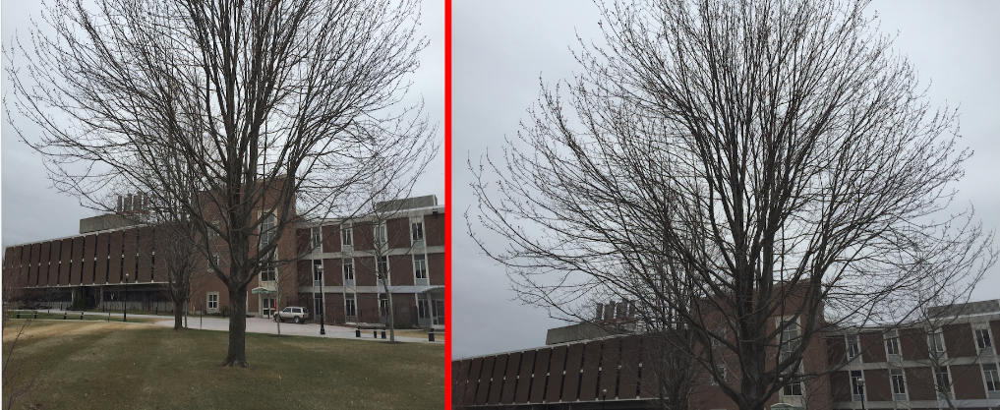
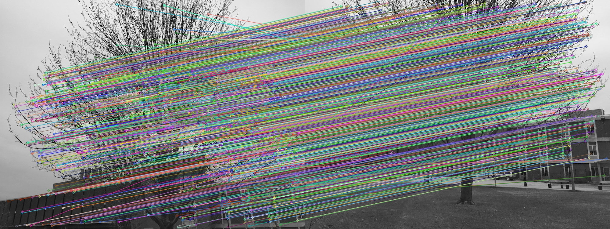
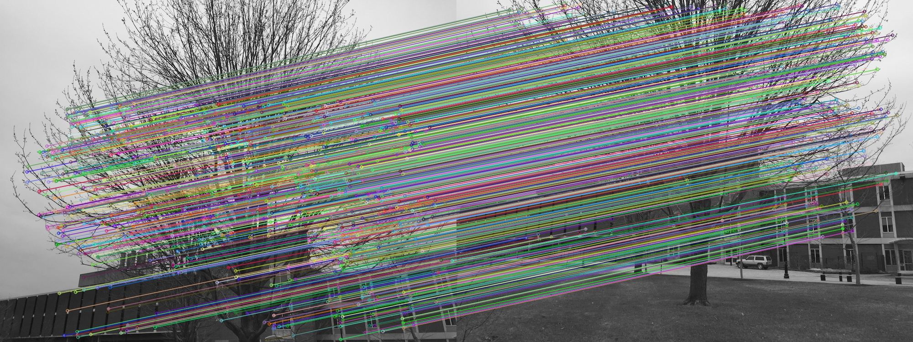
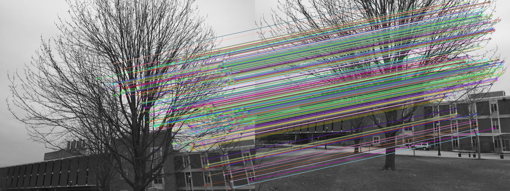
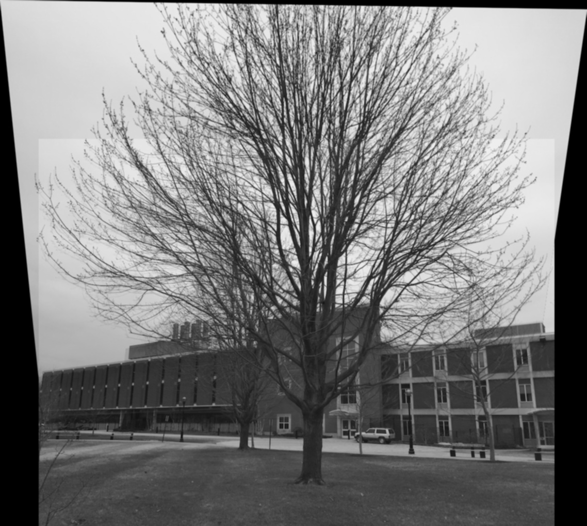

In this blog we take look at a script I wrote which determines if images are taken of
the same scene, and if so stitch them together to create a nice image montage/panoramic.

## SIFT Keypoint extraction

For keypoint extraction I decided to go with SIFT(Scale-Invariant Feature Transform).
I found SIFT to be the easiest to understand and a great introduction to key point
extraction. There are of course alternatives such as SURF, BRISK and FREAK.

### Scale-space extrema detection

Extrema points are most likely key points, and to be scale invariant we must search
for stable points across multiple scales.

To do this SIFT utilizes an image pyramid, where each level(octave) is derived 
from applying some function to the image below.

For example the following image shows a image pyramid which applies the mean function
at each level


For SIFT at each level we apply the Difference of Gaussian kernel which is a fast 
approximation to scale normalized Laplacian of Gaussian. After each level the
Gaussian image is down sampled by a factor of 2 or 1/4th the orginal size. See below
for illustration.


Once the Difference of Gaussian image pyramid has been computed, the pyramid is
searched for local extrema over scale and space. A point is local in our case when 
compared with its 8-connected neighbours, 9 pixels from above and 9 pixels from below.


#### Keypoint localization

For each keypoint candidate position, interpolation is done using the taylor expansion of
the Difference of Gaussian function with the keypoint as its origin, we refer to this as D(x).
If the intensity at the candidate extrema is less than the 0.03 threshold value
stated in the David Lowe paper, it is rejected.

Difference of Gaussian often has a high response to edges. In order to increase
stablility, we seek to remove candidate keypoints that have poorly determined 
locations but high edge response. 

To do this a 2x2 Hessian matrix is used to compute the principal curvature of D(x).
The result are two eigen values lets call them alpha and beta which are proportional
to the principal curvatures of D(x).

Key points with poorly defined peaks in the Difference of Gaussian function have 
larger principal curvature across the edge than along it. Thus we can form a ratio
with the alpha and beta eigen values to use as a threshold, in the paper this
threshold value is defined as 10.

#### Keypoint orientation

To achieve rotation invariance we must assign the keypoint with a orientation. We
first construct a histogram with 36 bins which covers 360 degrees around our
keypoint, next we calculate the gradient magnitude and direction of the neighboring
pixels(8-connected) and add them to the histogram.

The orientations within 80% of the highest peaks are assigned to the keypoint. For each
additional orientation assigned, new keypoints are created having the same position 
and scale as the original keypoint.

#### Keypoint descriptor

Now that we have a set of keypoints that are both scale and orientation invariant.
We need to generate unique "signatures" for these keypoints. To produce this
signature we take a 16x16 pixel block around the keypoint. This block is then equally
divided into 4x4 sub-blocks and for each of these 4x4 sub-blocks a 8 bin orientation
histogram is created.

In total this gives us 128 values, which is represented as a vector to form the
unique keypoint descriptor.

The following is an illustration on how keypoint descriptor works. Note that instead
of a 16x16 block, the image shows a zoomed in 8x8 block divided into 4x4 sub-blocks.


## Feature matching with FLANN

There are two common methods for feature matching, brute force matching and FLANN.

Brute force matching performs an exhaustive search and guarantees the best match,
but this comes at the cost of being extremely slow.

FLANN or "Fast Library for Approximate Nearest Neighbors" is much faster but does 
not gaurntee the best match,but instead provides the approximate best match. 
To achive its speed FLANN stores the key points in a [k-d tree](https://en.wikipedia.org/wiki/K-d_tree), 
which is a special cases of a binary space partitioning trees. Once all the key 
points are inserted into the k-d tree, k-nearest neighbors algorithm is ran with k set to 2.

This returns the best match and second best match, their similarities are then
compared via a ratio test. If the result is a high ratio this would suggest that the
best match is not unique and maybe a part of a repeated pattern, thus we should 
discard the pair. If on the other hand we obtain a pair with a ratio that falls 
within our threshold this would suggest that the best match is unique.

## CODE: keypoint matching

```python
#SIFT(read note on SIFT patent)
sift = cv2.xfeatures2d.SIFT_create()
kpt1, des1 = sift.detectAndCompute(img1,None)
kpt2, des2 = sift.detectAndCompute(img2,None)
#FLANN key point matching
FLANN_INDEX_KDTREE = 0
index_params = dict(algorithm = FLANN_INDEX_KDTREE, trees = 5)
search_params = dict(checks = 50)
flann = cv2.FlannBasedMatcher(index_params, search_params)
matches = flann.knnMatch(des1, des2, k =2)
#Finding good matches
good = []
pts1 = []
pts2 = []
for i, j in matches:
    if i.distance < 0.8*j.distance:
        good.append([i])
        pts2.append(kpt2[i.trainIdx].pt)
        pts1.append(kpt1[i.queryIdx].pt)
#Return image with matched keypoints highlighted
good = np.array(good)
pts1 = np.array(pts1)
pts2 = np.array(pts2)
print('Matches found: %d'%(good.shape[0]))
out = cv2.drawMatchesKnn(img1, kpt1, img2, kpt2, good, None, flags =2)
cv2.imwrite(img_out+"_match_init.jpg", out)
```
### Note on SIFT patent

Since OpenCV 3.4.3 SIFT and SURF algorithms have been moved behind a
``OPENCV_ENABLE_NONFRE`` flag. This is due to SIFT being patented and thus cannot
be legally distributed under OpenCV's MIT license.

There are two workarounds for this. One is to roll back to a version before this
change was pushed out. Second solution is to compile OpenCV yourself with the 
``OPENCV_ENABLE_NONFREE=1`` enabled. You can read more about it here [OpenCV #126](https://github.com/skvark/opencv-python/issues/126).

According to the [SIFT patent](https://patents.google.com/patent/US6711293B1/en) it
is set to expire on 03/06/2020. A [Github issue](https://github.com/opencv/opencv/issues/16736) 
has already been opened to move SIFT back into the main repository.

## Fundamental matrix

The next step in our process is to calculate the fundamental matrix and determine
if the images have sufficient matches to be recognized as originating fromt the same
scene. 

To understand what the fundamental matrix is and why its important, we need to take a 
look at epipolar geometry. 


The image above depicts a typical stereo vision scenario, where two optical 
sensors(**O1** and **O2**) are observing an object **P**, these three points together
forms the epipolar plane(grey area). The projection of **P** on to each image planes
is represented as **p** and **p'**.

The orange line connecting the two image sensors is referred to as the baseline, the
locations where the baseline intersects the two image planes are know as the 
epipoles(**e** and **e'**), and the intersection of the epipolar plane and the two
image planes are know as the epipolar lines(blue lines).

Fundamental matrix is a 3x3 homogeneous matrix that encodes information about the
camera matrices, relative translation and rotation between cameras, this allows us 
to use epipolar geometry to deduce relations between images pairs without 
knowing all the constraints. In other words if we know the fundamental matrix, any 
point in one image allows us to calculate the epipolar line of the respective 
point in the other image.

Luckily for us, we do not acutally need to know the intrinsic and extrinsic camera 
matrices nor the relative transformations between the cameras to calculate the
fundamental matrix. We can simply estimate the fundamental matrix with 
[Random sample consensus (RANSAC)](https://en.wikipedia.org/wiki/Random_sample_consensus).

## Homography estimation and image stitching
The final step in image stitching is finding the homography matrix. The homography matrix
in essence allows an image to be transformed from one image plane to another. 

To estimate the homography matrix we can again use RANSAC. 
Estimating the homography matrix also serves a second purpose, if we see a 
significant drop in the number of matches this would indicate that the images can 
not be aligned accurately enought to form a good panoramic.

## CODE: Fundamental and Homography matrix

```python
# good: matched pairs from FLANN
# pts1: matched point from image 1
# pts2: matched point from image 2 

def homoEst(pts1, pts2, good):
    H, stat = cv2.findHomography(pts1, pts2, cv2.RANSAC, ransacReprojThreshold = 1.0, confidence = 0.99)
    h_match = good[stat.ravel() == 1]
    print("Inliers count after Homography estimate %d"%(h_match.shape[0]))
    return H, h_match

def fundEst(pts1, pts2, good):
    FM, mask = cv2.findFundamentalMat(pts1, pts2, cv2.FM_RANSAC, 1.0, 0.99)
    fm_match = good[mask.ravel() == 1]
    print("Inliers count after Fundamental estimate: %d"%(fm_match.shape[0]))
    return FM, fm_match
```

## Image stitching

If we retain sufficent keypoint pairs after running through Homography estimation 
and Fundamental matrix estimation, we can then begin image stitching.

First step in the process is to determine an anchor image which will remain fixed,
while the second image will be warped and mapped to the perspective of the anchor 
image.

To do this we can calculate the norm of the homography matrix. Note that norm-2 takes
the inverse of the homography matrix this is due to the original homography matrix 
being calculated from image 1 mapped to image 2.
```python
norm1 = np.sqrt(H[-1,0]**2 + H[-1,1]**2)
norm2 = np.sqrt(np.linalg.inv(H)[-1,0]**2 + np.linalg.inv(H)[-1,1]**2)
```
If norm-1 is larger than norm-2 we warp image 1 to image 2, if on the other hand 
norm-2 is larger than norm-1 we warp image 2 to image 1.

Once the anchor image has been determined we can calculate a translation matrix for
the second image by using the homography matrix to remap the image corners.

```python
#remap corners to new frame
def remap(x,y,z,w,H):
    x_dot = np.dot(H,x)
    y_dot = np.dot(H,y)
    z_dot = np.dot(H,z)
    w_dot = np.dot(H,w)
    return x_dot/x_dot[-1], y_dot/y_dot[-1], z_dot/z_dot[-1], w_dot/w_dot[-1]

#calculates the translation offset base on the corners
#returns a compsite matrix
def calcTranslation(img1, img2, H):
    C1,C2,C3,C4 = remap(np.array([0,0,1]),np.array([img1.shape[1],img1.shape[0],1]),np.array([0,img1.shape[0],1]),np.array([img1.shape[1],0,1]),H)
    minX = min([C1[0],C2[0],C3[0],C4[0]])
    minY = min([C1[1],C2[1],C3[1],C4[1]])
    osX = abs(minX) if minX < 0 else  0
    osY = abs(minY) if minY < 0 else  0
    matrix = np.array([ [1,0,osX],[0,1,osY],[0,0,1] ])
    composite = np.dot(matrix, H)
    return composite, osX, osY
```
Next to integrate both images together we need to calculate the new coordinates for both image 1 and image 2.
```python
def warp(composite, osx, osy, img1, img2):
    #calculate new coordinates for image1 and image 2
    img1_c1, img1_c2, img1_c3, img1_c4 = \
        remap(np.array([0,0,1]),np.array([img1.shape[1],img1.shape[0],1]),np.array([0,img1.shape[0],1]),np.array([img1.shape[1],0 ,1]),composite)
    img2_c1 = (osx, osy)
    img2_c2 = (osx + img2.shape[1], osy + img2.shape[0])
    img2_c3 = (osx, osy + img2.shape[0])
    img2_c4 = (osx+img2.shape[1], osy)
    #calculate size of new image
    col = max([img1_c1[0], img1_c2[0], img1_c3[0], img1_c4[0],\
            img2_c1[0], img2_c2[0], img2_c3[0], img2_c4[0] ]) 
    row = max([img1_c1[1], img1_c2[1], img1_c3[1], img1_c4[1],\
            img2_c1[1], img2_c2[1], img2_c3[1], img2_c4[1] ])
    #print image size
    r1 = cv2.warpPerspective(img1, composite, (int(col),int(row)), flags = cv2.INTER_LINEAR)
    r2 = np.zeros(r1.shape, dtype = r1.dtype)
    r2[int(osy):img2.shape[0]+int(osy), int(osx):img2.shape[1]+int(osx)] = img2
    return r1, r2
```

### Image blending

At this step we have the final canvas size of the panoramic and two images with its 
coordinates remapped/wrapped. For regions that are not overlapping we can copy 
directly from source image to the final canvas. For regions that are overlapping we
can create a mask with its weight split 20/80.

```python
stitch = img1_canvas + img2_canvas
overlap1 = np.copy(img1_canvas)
overlap2 = np.copy(img2_canvas)
overlap1[np.where(stitch ==2)] = 0.20
overlap2[np.where(stitch ==2)] = 0.80
fin_stitch = (r1*overlap1) + (r2*overlap2)
fin_stitch = cv2.GaussianBlur(fin_stitch, (3,3), 2)
cv2.imwrite(img_out, fin_stitch)
```
## Results

Below are the two images that we wish to stitch together



Here are the keypoints detected after the inital FLANN matching



Inlier keypoints after Fundamental matrix estimation



Remaining keypoints after homography estimation



Finally here are the two images stitched together along with the output log



```
Comparing image2.JPG and image3.JPG
Matches found: 1287
Inliers count after Fundamental estimate: 966
Fundamental decision ---
Matched scene: inlier threshold meet
Inliers count after Homography estimate 397
Homography decision ---
image2_image3 Possible for alignment
Alignment possible: combine images
Warp Image 1 -> Image 2
```


