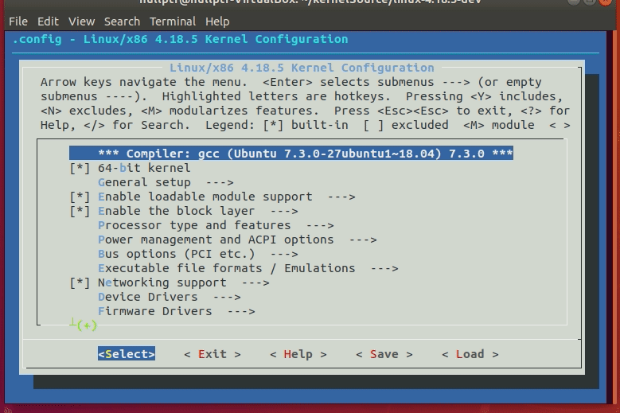
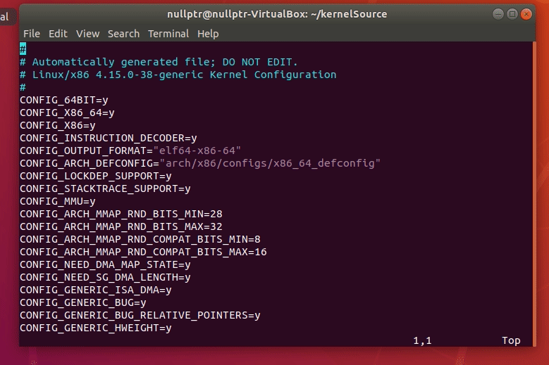
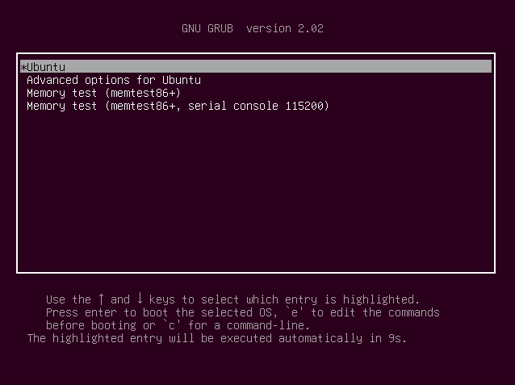

The goal of this particular post is to walk you through on how to setup up your 
system for linux kernel development. Later on we will go more in depth on topics 
such as Kernel data structures, TCP implementation, and even how to write your own 
system calls.

Now before we start with the guide, I highly encourge you to download and use a 
virtual machine when playing with kernel code, for our purpose either VMware or 
VirtualBox will do the Job. 

## Inital setup
In this guide we will be using the 64-bit version of Ubuntu 18.04, but any distro 
should be fine albeit with minor differences. Next we need to download the tarball 
containing the kernel source code, you can follow this link to the download page, 
I will be using kernel version 4.18.5 through out this guide.

Next up we want to change our grub settings so that we can boot into our fancy 
custom kernel later on, to do this spin up a terminal and run
```
sudo vim /etc/default/grub 
```
and change these two lines to read
```
GRUB_TIMEOUT = -1
GRUB_TIMEOUT_STYLE = menu
```
save and exit, then apply our changes by running,
```
sudo update-grub
``` 
Next up run 
```
sudo software-properties-gtk
``` 
check the box that says ``source code``, then click close. A warning will popup 
nagging you about out of date software, we can simply ignore it and click reload.

Now assuming that you saved the tarball that we previously downloaded in 
``~/Download`` we run the following commands to set up our workspace.
```
mkdir kernelSource
cd kernelSource
mv ~/Downloads/linux-4.18.5.tar.xz .
tar -xf linux-4.18.5.tar.xz
```
If you are like me and can't remember tar flags to save your life, dont sweat my 
friend Arnold is here to help.

Next we can delete the tarball and make two copies of the extracted files, one for 
development and one for storing the original.
```
rm linux-4.18.5.tar.xz
mv linux-4.18.5 linux-4.18.5-original
cp -r linux-4.18.5-original linux-4.18.5-dev
```
Now we need to download some extra package for our build tools
```
sudo apt-get build-dep linux-image-$(uname -r)
```
We also need to download some dependencies required for menuconfig. menuconfig is a 
ncurses based graphical tool allowing us to configure kernel settings, this is 
highly recommended unless you want edit the setting through a text file.
```
sudo apt-get install libncurses5-dev bison pkg-config flex libelf-dev libssl-dev
```
## Configuring the kernel
Now that we have everything installed, we can configure the kernel using menuconfig,
but first we need to copy our config file from boot into our development directory
```
cd linux-4.18.5-dev
cp /boot/config-$(uname -r) .config
```
next we need to remove the module sig key in the config file, if you are intrested in
what sig keys do, you can read about it <a href="https://wiki.gentoo.org/wiki/Signed_kernel_module_support">here</a>.
```
sudo vim .config
```
find the line that reads ``CONFIG_MODULE_SIG_KEY =`` and remove everthing behind the
equals sign on that line.



One last thing before we run menuconfig, we need to streamline our config file
```
./scripts/kconfig/streamline_config.pl > ../config.streamlined
```
This little magical script allows us to cut down our kernel build time. It does this
by calling lsmod to find all modules running on the current system, it then reads 
all makefiles to map which config enables which module, followed by reading the 
Kconfig files to find the dependencies and selects that may be needed to support a 
config, finally it reads the config file and removes any modules that is not needed 
to enable the currently loaded modules.

now we just need to clean up a little and move our config file back to our working 
directory
```
make mrproper
cp ../config.streamlined .config
```
To launch menuconfig run
```
make menuconfig
```
navigate with the arrow keys to ``Device drivers->Graphics support->Bootup logo`` 
enable this setting with Y, save and exit. Bootup logo support is needed or else 
when grub tries to use ``Plymouth/quite/splash`` boot options you will get garbled 
screens. 


## Building and installing the kernel
Lets make some changes to our kernel, compile it and then install it. For now we 
will do somthing easy like changing kernel EXTRAVERSION number.

To do this we move to our development directory and edit our Makefile, under 
``EXTRAVERSION=`` we can add our own versioning information I decided to go with my 
name ``EXTRAVERSION=-David``

Once you are satisfied with your extraversion name its time to build your kernel, run
the command
```
make
```
This step could take from 20 to 40 minutes depending on your computer, so go ahead 
and grab yourself some coffee, turn on your favorite TV show, check out some of my 
other posts and come back in  about half an hour.

Ok, hopefully it didn't more than 30 mins, now assuming your build ran without error,
you can now run
```
sudo make modules_install
sudo make install
```
which will create the initramfs and invoke update-grub all in one command.

Congratulations!! you have now built and installed your very own kernel. Now we just
need to reboot, and select the new kernel under "Advanced Options".



Once Ubuntu has been booted you can check your kernel version by typing ``uname -r``
into the terminal. you should see ``4.18.5-David`` or what ever you choose for your 
extraversion name. 
