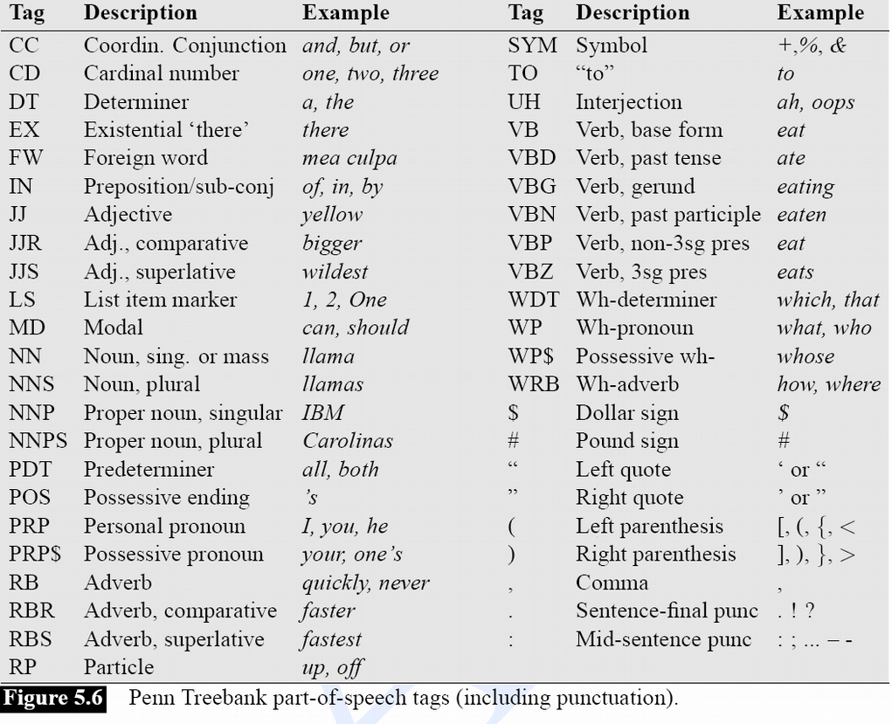
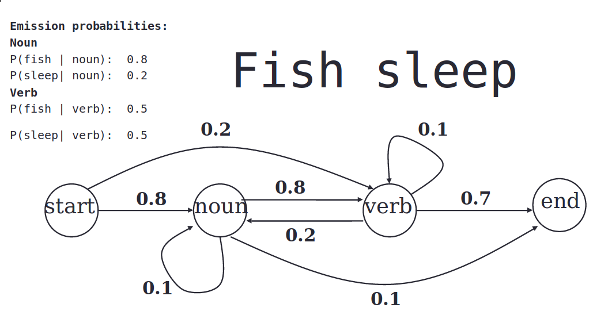
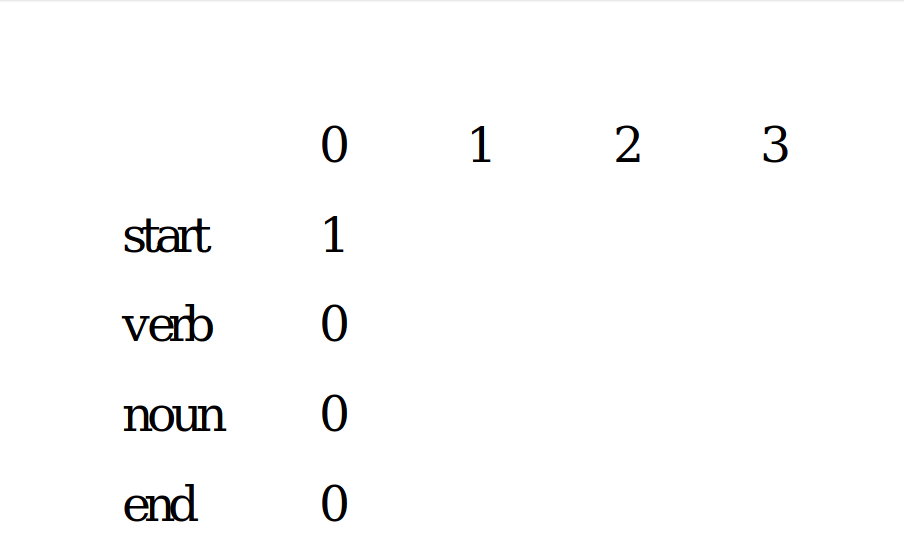
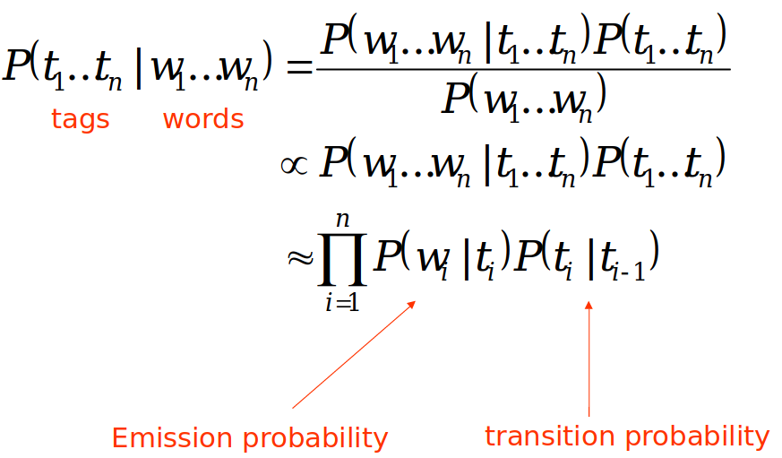

Parts of speech tagging is the procces of marking up words in a given set of text 
with their corresponding parts of speech tag, taking into account their definition 
and the context in which they are use.

A good question at this point is, what is POS taggin used for? and why is it useful?
POS tagging are essential for building parse tress, and extractin relationsips 
between words. POS tagging is also used in building lemmatizers for root form 
reduction. 

## Parts of speech
The traditional parts of speech that you might have been taught in school, probably 
consists of the following seven

1. Noun
2. Verb
3. Adjective
4. Adverb
5. Preposition
6. Pronoun
7. Determiner

For accurate POS tagging we require a much finer set of tags. The image shown below 
are the 36 seprate parts of speech tags used in the orginal penn treebank.



In our <a href="https://github.com/DWShuo/posTagger/tree/master/data" target = "_blank">data file</a> we are given the option of using a fine grain POS tag or a coarse 
grain POS tag. For our purposes we will be using the 17 coarse grain set of tags, 
they are as follows 

- ADJ: adjective
- ADP: adposition
- ADV: adverb
- AUX: auxiliary verb
- CONJ: coordinating conjunction
- DET: determiner
- INTJ: interjection
- NOUN: noun
- NUM: numeral
- PART: particle
- PRON: pronoun
- PROPN: proper noun
- PUNCT: punctuation
- SCONJ: subordinating conjunction
- SYM: symbol
- VERB: verb
- X: other

## Parsing Conllu file
Parsing the conllu data file can be a little tricky but luckily for us, the user <a href="https://github.com/EmilStenstrom/conllu" target = "_blank">EmilStenstrom</a> has
already made a parsing library for us to use.

Here is a quick code snippit on  how to use it. 
```python
def parseConllu:
data_file = open(path,"r", encoding="utf-8")
    for tokenlist in conllu.parse_incr(data_file):
        for each in tokenlist:
            for i in range(len(each)):
                # Coarse grain tag
                print(each[i]['upostag'])
                # Word
                print(each[i]['form'])
                # Normalized word
                print(each[i]['lemma'])
```
As you can see the parser stores the input corpus as a list of dictionaries, with 
each word corresponding to a dictionary.

## Hidden Markov Model
Hidden markov model is espically useful if the subject state of our prediction is 
hidden. In other words given a sequence of past oberservations we try to deduce the 
most likely outcome state.

For the purpose of parts of speech tagging, we can see that the words being inputed 
are the observed states and our prediction is the part of speech.

Lets look at an example.

Say we are given the sentence **Fish sleep**, along with the transitional probabilites 
and the emission probabilities, we are then tasked with finding the correct set of 
POS tags.

The given transitional probabilites are simply the probability of a POS transitioning
to another POS eg. Noun to Verb.

The Emission probability is the probability of a certain word emmiting from a 
particular Parts of speech eg. Noun to Fish.

Note that all of the probability given are learned from past oberservations or 
training data. 




The above GIF is the solution to the example, after i explain the solution you 
might need to come back and watch it a couple time to understand whats happening.

1. The first step is to look at the starting probability, or the likely hood of a sentence starting with a particular POS, then we multiply that probability with the emission probability of the first word given to our model.
2. Next we look at the transitional probability going from our current POS to the next POS, we multiply that probability with the probability calculated in the previous step.
    - **NOTE:** this time at index 2 there are 2 possible entries per cell. Verb to Verb or Noun to Verb and vice versa for the cell directly underneath.
3. Just like before we multiply the emission probability of the next word given to our model. At this point we have 2 entries per cell, and we can eliminate the one with the lowest probability before we move on.
    - **NOTE:** Elimination can only occur in the same cell, you cannot eliminate a probability if they are in different cells.
4. We carry on this procecure until we reach the end, and backtrace the path with the highes probaility to obtain our list of POS candidates

To sum it up we are essentially trying to take the argmax of the following equation.



## Final result
Runing our model on the English test set we achieve around 91% accuracy level, while
on the Spanish model we achieve around 95% accuracy level.
