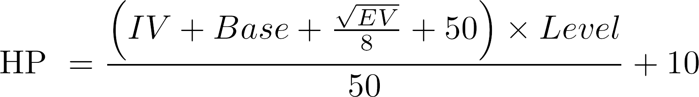
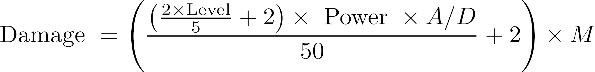
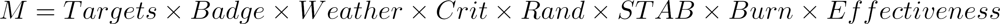

Pokemon RPI is a re-creation of the classic generation one and two Pokemon games 
taking place in the setting of Rensselaer Polytechnic Institute campus. 
In this article I want to talk about the major game mechanics and their 
implementation. 

## Stat Mechanics
Although the setting of the game might have changed to that of the RPI campus,
we wanted the general experience of the game to stay true to the original Pokemon 
red/blue, thus we have decided to re-implment to orginal stat mechanics. 
So without further ado, lets dive into the logic and implementation. 

Each instantiated Pokemon object contains six core stat values. 

To calculate these six values, there are four other minor values we are intrested 
in, these are the Base stat values,  Level of the Pokemon in question, Individual 
values or IV and Effort values or EV. 

The base stat values are what every pokemon of that specific species inherits, we 
store these values in a simple look-up table, since each species of Pokemon is 
unique, there is no need for a hash function. Thus the end result is a look-up 
table of 151 entries, where we can index each pokemon by their pokedex number.

Individual value(IV) are "random" core state modifiers generated when a new pokemon 
is instantiated, this value is what causes variation in states between pokemons of 
the same species. IV have a range from 0 to 15, in binary that is 0000 to 1111, 
each core stat has a IV modifer value generated expect for HP, which is calculated 
by taking the last binary digit of Attack, Defense, Speed and special IV's and 
placing it in that order. 

Effort value(EV) can be thought of as experince points for each of the core stat 
values, in Pokemon red/blue, the amount of EV awarded is equal to the base stat 
values of the defeated Pokemon.

To calculate the core state values there are two formulas we must use. The first is 
used to calculate the HP stat value, while the latter is used to calculate all 
other core stat values. 

## Combat Mechanics

Combat mechanics utilizes a hash map containing 251 move objects, each move object 
contains a variable for move name, type, category, PP, power, accuracy and contest.
We picked hash map over hash table, mainly for two reasons. First hash table is 
synchronized and as a general rule of thumb unsynchronized objects in java tends to 
perform slightly better than synchronized objects. Second hash map allows for null 
key and null values, this is optimal since many of the status category moves do not 
have values for power and accuracy. 

Combat calculations are pretty stright forward but contains a myrid of variables we 
must account for, so before we dive into it, lets take a look at some combat 
modifiers.

Certain moves in the game, most commonly in the status category have the ability to 
apply modifiers to the core stats. Modifier have six stages in both both directions.
The table below shows the modification values at each stage 

Similarly there are also items and moves that can effect critical hit, when a 
critical hit lands it doubles the damage dealt by the move. All moves begin at stage
zero with 6.25% chance for a critical hit, and caps out at stage four or 50% chance 
for a critical hit.

Now that we have covered these combat modifer, lets take a look at the combat 
equation itself. The combat equation defines the damage dealt by the attacking 
pokemon, and is as follows. 

Level is the level of the attacking pokemon, Power is the attacking power of the 
move, variable A is the attack stat for the attacker and variable D is the defense 
stat of the defender, M is a place holder variable for all the modifiers, which are 
defined as follows. 

  * Targets takes on the value 0.75 if the move has more than one target, else its 1.
  * Weather takes on the value of 1.5 if an elemental attack is used in the 
  corresponding weather contition, such as a fire-based move during harsh sunglight 
  weather. If the opposite is true, such as fire-based attack is used during rain, 
  then weather takes on a value of 0.5, else it defaults to 1.
  * Badge multiplier of 1.25 is applied if the player holds the gym badge 
  correspoding to the used move type, else value of 1 is assigned.
  * Critical takes on value of 2 if rolled, else it defaults to 1.
  * Random is simply a random number generated between [0.85, 1.00] .
  * STAB or same-type attack bonus is set to 1.5 if the move type matches the type 
  of the pokemon used else it defaults to 1.
  * Burn modifer applies a 0.5 reduction if the pokemon has the burned effect and 
  uses a physical move, otherwise its defaults to 1.
  * Effectiveness applies a multiplier value of 0, 0.5, 1, 2, depending on the 
  effectiveness of the attacker's type against the defender's type, below is a 
  handy chart displaying such relationships.

There are a multitude of ways one could use to store the above information, the 
method that we choose to implement invovles enumerating the types and creating a 2D 
array, such that we can index the effectiveness multiplier by supplying two numbers 
that corresponds with the types in question. 

## Experience Mechanics
The experience mechanics descirbes how fast a certain Pokemon reaches their max 
level. All Pokemons are divided into four exprince groups, these are slow, medium 
slow, medium fast and fast.

The slow group features the highest amount of experience required for a Pokemon to 
reach level 100. This group contains many of the rare, legendary and pseudo-legendary
Pokemons. The equation below defines the amount of exprience needed for each level, 
where n is the level.

The medium slow group includes all starter Pokemon, and requires 1,059,860 
experience to reach level 100, and is the only group whoese level 100 experince is 
not evenly divisible by 10,000. 

The fast group is perhaps the most common group, introduced in Generation one, with 
800,000 experience needed for level 100. Many of the normal and fairy-type pokemons 
are in this group. 

