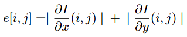

Ordinarily when a image is resized each pixel is treated equally, meaning everthing gets
reduced or increased by the same amount. This leads to weird distortions to the subject of
the image.

For example the following is a image of a skier and a helicopter.


If we were to resize it so that its a square we would see heavy distortions around the main 
subjects of the image.


## Content-Aware Image Resizing

In 2007 a paper was published titled "Seam Carving for Content-Aware Image Resizing", which suggest
resizing along seams of low energy. A vertical seam is defined in this case as one pixel per row and 
each pixel being 8-connected (pixels in adjacent rows differ by at most one column).

Formally a vertical seam of a M rows by N columns can be defined as. Where ``i`` is the row and ``c(i)``
is the chosen column in each row.


Once we have selected a seam, the pixels on the seam are then removed from the orginal image, and the rest
shifted over to fill in the blank spaces. This will then create a new M rows by N-1 columns image.

Below is an example of a vertical seam.


## Selecting seams

Now that we have a general understanding of what Content-Aware Image Resizing is, lets take a look at how 
exactly these seams are selected.

The seam we select to be removed, is the seam with the least energy. Energy is defined in our case
as the derivative magnitudes at each pixel.



Below is a python snippit that calculates image energy using the <a href="https://en.wikipedia.org/wiki/Sobel_operator" target = "_blank">Sobel kernel</a>.

```python
def calc_energy(img):#function calculates image energy
    #calculate energy of image, first convert to greyscale then apply sobel
    gray_scale = cv2.cvtColor(img.astype(np.uint8), cv2.COLOR_BGR2GRAY)
    sobelx = cv2.Sobel(gray_scale,cv2.CV_64F,1,0,ksize=3)
    sobely = cv2.Sobel(gray_scale,cv2.CV_64F,0,1,ksize=3)
    img_energy = np.abs(sobelx) + np.abs(sobely)
    return img_energy
```

The optimal vertical seam to be removed is thus the seam which minimizes this energy.


Given the exponential number of potential seams, a brute force solution is not optimal.
Looking at this a bit further we can see that this is a classic dynamic programming probelm,
which will allow use to solve for the minimal seam at linear time.

```python
def min_helper(left,right,center):
    lrcMatrix = np.stack((left,right,center), axis = 0)
    return np.min(lrcMatrix,axis=0)

def cumulative_energy(img_energy):
    row, col = img_energy.shape[:2]
    cumulative_energy = np.zeros((row, col))
    cumulative_energy[0,:] = img_energy[0,:]
    #set leftmost and right most col to 1mill
    cumulative_energy[0,0] = 1e6 
    cumulative_energy[0,-1] = 1e6
    for i in range(1, row):
        cumulative_energy[i-1,0] = 1e6 #set leftmost and right most col to 1mill
        cumulative_energy[i-1,-1] = 1e6
        #split into left right and center 
        left = cumulative_energy[i-1, :-2]
        right = cumulative_energy[i-1, 2:]
        center = cumulative_energy[i-1, 1:-1]
        mins = min_helper(left,right,center) #call min helper returns array of mins
        cumulative_energy[i,:] = img_energy[i,:] #set self energy value
        cumulative_energy[i,1:-1] = cumulative_energy[i,1:-1] + mins
        #set leftmost and right most col to 1mill
        cumulative_energy[i,0] = 1e6 
        cumulative_energy[i,-1] = 1e6
    return cumulative_energy
```

