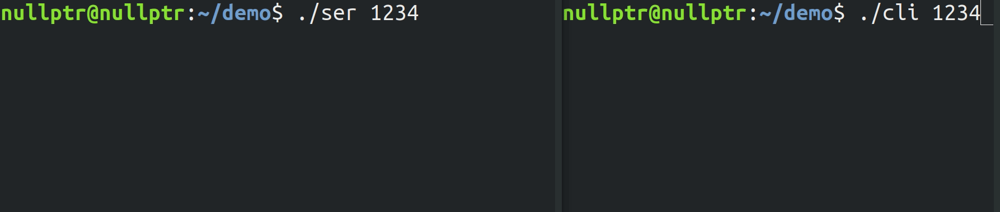
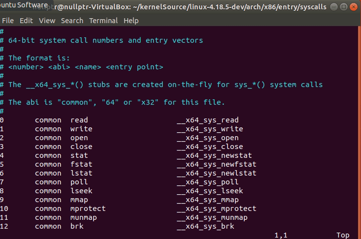
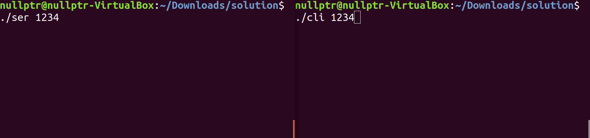

This article is part of a series on the linux kernel. Today we will be looking at 
Linux system calls, and how you can implement your own.

To start off if you haven't already set up your enviroment for kernel development, 
you can click here to follow a guide I wrote on that topic. 

## Proposing a problem
Instead of writing a system call that doesn't really do anything, lets make things 
a little more intresting. I will propose a probelm and we will attempt to resolve 
it by implmenting our very own system call.

In this problem, we have a basic server and client written in C, the code for both 
can be <a href="https://github.com/DWShuo/posTagger/tree/master/data" target = "_blank">found here</a>.

The server will attempt to send 5 messages to a connected client, while the client 
displays those messages as they are received. 

Below, is a small snippit from our client code.
```c
void recv_msg(int sockfd){
  char buffer[256];

  sleep(5); //Why does this brick our code?

  while(recv(sockfd,buffer,256,0)>0){
    printf("%s",buffer);
  }
  printf("No more data\n");
} 
```
The code snippet is simply a function wrapped around the typical client recv 
procedures, the only exception being the sleep call. 



As we can see the sleep call breaks our code quite a bit, we only see three out of 
the five messages on the client side. In the next section we will attempt to solve 
this by writing our own system call.

## Setting up system calls
System calls can be thought of as interrupts, in fact it is implmented as software 
interrupts. To explain this we can take a look at the ``syscall`` assembly 
instruction.

Without getting to much into low level assembly and registers, the ``syscall`` 
instruction causes an exception and transfers control to an exceptions handler, 
the way it determines which exception handler to call is by grabbing the system 
call number from the general purpose registers, most likely ``rax`` if you are 
using ``x86_64``

System call numbers are unique numbers assigned to each system call. These unique 
number are stored in the systemcall table located at
``/arch/x86/entry/syscall/syscall_64.tbl``.

Our first step then is to add our custom system call to this table. Go ahead and 
open up the table using your favorite text editor, and navigate down to the end of 
64-bit syscall entries, for me the last syscall number was 334, this could be 
different for you. 



```
335   common  read_lines       __x64_sys_read_lines
```
The above is what my system call entry looks like. Note that each column is 
seperated by tabs not spaces.

The first number indicates the syscall number, I choose 335 since its the next 
available number after 334.

The second column ``common`` indicates that this system call is used by both 32-bit 
and 64-bit CPUs.

The third column indicates the system call's name, in this case ``read_lines``

Finally the fourth column indicates the name of the function implmenting it, 
convention dictates that it should be prefixed with ``sys_``.

## Writing system calls
The final step in making our own system call is to write the system call function. 
Tradtionally miscellaneous system calls should be written in ``kernel/sys.c``, but 
since our system call modifies read behavior we add our changes to 
``fs/read_write.c``.

Now if we recall the original problem, where by adding the sleep call in the client,
we create a unwanted behavior where only three out of the five messages received 
were being displayed.

The culprit behind this behavior has to do with C string's null terminators. Recall 
that all C strings are terminate by ``"\0"`` thus sleeping in between receives, we 
end up stacking strings behind strings. Now think about how printf would behave if 
we pass it one of these string, how would it know when to stop? 

Below is the system call solution to fix our problem. 
```c
SYSCALL_DEFINE3(read_lines, int, fd, char __user *, bf, size_t, count){
  int read_count = 0;
  int single_read_count;
  char __user * last;
  last = buf + count - 1;
  while (1){
    single_read_count = ksys_read(fd, last, 1);
    if (single_read_count == 0){
      // We have exhausted the input stream
      return read_count;
    }
    buf[read_count++] = *last;
    if (read_count == count){
      // We have exhausted the output buffer 
      return read_count;
    }
    if (*last == '\0'){   
      // We have reached the null terminator
      return read_count;
    }
  }  
  // Something is really wrong here.
  return -1;
}
```
One thing that stands out the most from this code is the function decleration, 
instead of the usual C style function decleration, we have this strange 
``SYSCALL_DEFINE3`` decleration. 

``SYSCALL_DEFINE`` is acutally a class of MACROS defined in 
``include/linux/syscalls.h``. If we look at the signature of ``SYSCALL_DEFINE3`` we 
see that it first takes in the syscall name, the type of the first argument, the 
first argument, the type of the second argument, the second argument, and so on. 
It is then clear that the 3 in ``SYSCALL_DEFINE3`` indicates the number of arguments
the syscall takes in.

The code itself is rather simplistic, we keep a counter while we read our input. 
Once we reach the max buffer size, or hit an null terminator, we return the number 
of bytes read, just like how the original read system call would do.

Now all we need to do is build our kernel and we should be good to go.
```
make
sudo make modules_install
sudo make install
```
Followed by a reboot, make sure to select you new kernel, although by deafult grub 
should select the newest version of the kernel.

To use our new system call we need to make some small changes to our client.c 
```c
#define SYS_read_lines 335
void recv_msg(int sockfd){
  char buffer[256];
  ssize_t nbytes = 0;

  sleep(5); //no longer break our code

  while(syscall(SYS_read_lines,buffer,256,0)>0){
    printf("%s",buffer);
  }
  printf("No more data\n");
}
```
First we defined our syscall and gave it a name, next we use the ``syscall()`` 
function provided by the ``GNU C library`` to call our system call. The provided 
syscall function handles the syscall interrupt for us, such that we dont have to 
trigger it manually.


As you can see our system call fixed the problem we had orginally proposed. 
Congratulations now you know how to write your own system calls. 

## Bonus: Creating kernel patch
Now that you have made your own system call. I bet you are excited to share your 
awesome new syscall with your friends, but how would you go about sharing it? I hope
you are not thinking about sending the entire kernel source code to them.

We can easily share our kernel changes by creating a kernel patch.

If you've followed my previous guide on how to setup your enviroment for kernel 
devolpment, then you can just followed the steps below, otherwise some modifications
might be required.

**Creating kernel patch:**
  1. First run the command ``make mrproper`` in both linux-4.18.5-original and linux-4.18.5-dev, this gets rid of any intermediate build files we have left over, we dont want to include those in our patch file.
  2. Next we run ``diff -rcNP linux-4.9.45-original linux-4.18.5-dev -x signing_key.* -x x509.genkey -x fixdep -x objtool -x inat-tables.c > mypatch.diff``

**Applying kernel patch:**
  1. Navigate to the directory where you want to apply the kernel patch eg. ``cd linux-4.18.5-dev``
  2. Next run ``patch -p1 < ../mypatch.diff``


