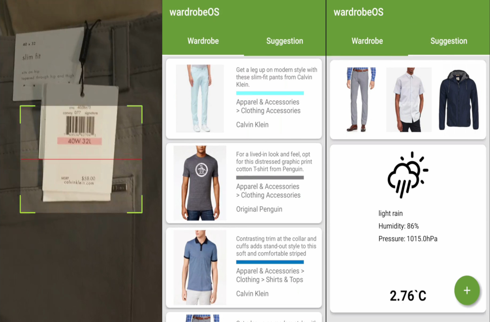
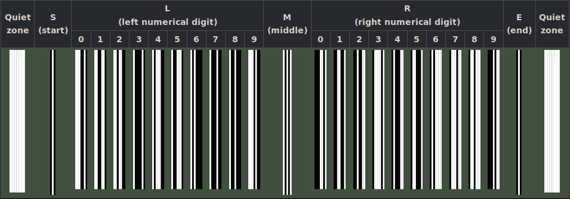
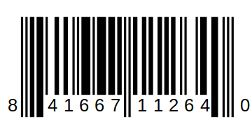

I had two goals in mind when I set out to start this project. The first goal was to 
teach myself about android development and the second was to help me streamline my 
morning routines. 

## Brainstorming Features
From experience working on other side projects. I found that to prevent the eventual
feature creep, a good idea to generate a list of core features before actually 
starting to code.

The idea of the App is to create a virtual wardrobe that would suggest outfits on a 
daily basis and a myriad of factors such as color coordination, season, and weather 
would contribute to making the decisions.

Feature List: 
  - To make this App viable, it needs be user friendly. Thus the first feature to implement is a simple and stright forward way of adding new clothing items.
  - The second feature to be implemented is method of retrieving local weather information.
  - Third, we need to implement a logic system for color and pattern coordination.
  - Lastly we need to implement a suggestion engine that ties all the above factors together.

## Adding new items
When a new article of clothing is entered into our system, we want to make sure 
that four pieces of key information are present. 

These are:
  - Image of the item.
  - Brand of the item, e.g. Brooks Brothers, LL Bean.
  - Category of the item, e.g. Shorts, Button Downs, Rain Coat.
  - Color of the item, e.g. ``#000080``(Navy Blue).

Therein lies our problem, from a usability perspective this is an absolute nightmare.
Expecting the user to manually enter all the above information for every new 
purchase is not an acceptable solution. 

The solution to this problem is to use the barcode tag that comes with every item at 
the time of purchase. These barcodes typically follows the standard of UPC-A, which 
consists of 12 number that are uniquely assigned to each item and follows the below 
format.



## Aside: reading barcodes
Given an example barcode below

The first number on the left side indicates the numbering system, such that if the 
first digit is 
 - 0,1,6,7,8 this indicates its a standard UPC item.
 - 2 indicates random weight items, e.g. fruits, meats.
 - 3 indicates pharmaceutical items.
 - 4 reserved for local use, e.g. loyalty cards.
 - 5 indicates its a coupon.

The next five digits typically indicates the manufacturer code. In our example 
``11204`` corresponds to the manufacturer code for Amazon. The next set of five 
digits indicates the product code, and finally the last digit represents the 
checksum, which is responsible for making sure all the barcode number were read 
correctly. 

Now back to where we left off. Our next step is to implement the barcode scanning 
feature. Instead of rolling our own barcode scanning program, which should be an 
interesting project on its own. I've decided to use an existing open source project 
named <a href="https://github.com/zxing/zxing" target = "_blank">Zebra Crossing</a>.

Once we obtain the UPC number by scanning the barcode, we can proceed to look it up 
in a database. There are many databases available for this purpose, some are free 
and some require a subscription service. For my project I ended up choosing <a href="https://www.upcitemdb.com/" target = "_blank">upcitemdb</a>, they offer a free account that allows 100 API calls per day. 

To request a lookup is quite simple, we just need to append the UPC code to the end 
of the request URL like so. 
```
https://api.upcitemdb.com/prod/trial/lookup?upc=841667112640
```

The response is in the from of a json file, which contains the name of the item, 
description , brand, color, and links to images of the item. 

```json
"code": "OK",
"total": 1,
"offset": 0,
"items": [
  {
    "ean": "0841667112640",
    "title": "Amazon - Echo Dot",
    "description": "Deliver your favorite playlist...
    "upc": "841667112640",
    "brand": "AMAZON FULFILLMENT SERVICES",
    "model": "DOTBLACK",
    "color": "Taupe",
    "lowest_recorded_price": 10,
    "highest_recorded_price": 3639,
    "images": [
      "https://target.scene7.com/is/image/Target/...
      "http://img.bbystatic.com/BestBuy_US/images...
      "https://images.homedepot-static.com/produc...
    ],
```
Once we have parsed all the information we need from he json file, we need to 
decided how to store it. One options is just to store them in a list of cloth 
objects, another option is to use SQLite which would make querying for cloth color 
and type extremely easy. For now I've decided to go with the easy route an just use 
a list of cloth objects. 

The final product would look something lis this


## Weather Data
Next up we need to find a way of getting weather data for our App. Weather data 
plays an important role in our algorithm, we need the temperature to know what type 
of clothing to suggest, we also need weather condition to know what type of 
outerwear to suggest. 

Luckily for us there are many existing free weather API's that we can utilize. I 
ended up going with <a href="https://openweathermap.org/" target = "_blank">Open Weather Map</a>. Before we can request an API call we need to 
know the location of the user, so we need to add the location permission to the 
manifest, ``ACCESS_COARSE_LOCATION`` will do fine.

Using the returned longitude and latitude coordinates we can make a API call to 
OpenWeatherMap like so 
```
api.openweathermap.org/data/2.5/weather?lat={lat}&lon={lon}
```

The API then responds with the following 

```json
{"coord":{"lon":-122.09,"lat":37.39},
"sys":{"type":3,"id":168940,"message":0.0297,"country":"US","sunrise":1427723751,"sunset":1427768967},
"weather":[{"id":800,"main":"Clear","description":"Sky is Clear","icon":"01n"}],
"base":"stations",
"main":{"temp":285.68,"humidity":74,"pressure":1016.8,"temp_min":284.82,"temp_max":286.48},
"wind":{"speed":0.96,"deg":285.001},
"clouds":{"all":0},
"dt":1427700245,
"id":0,
"name":"Mountain View",
"cod":200}
```

After parsing the returned information we can simply store it in a variable for 
later use, and display the relevant information on the main page of the App. 

## Color & pattern coordination

## Suggestion engine


